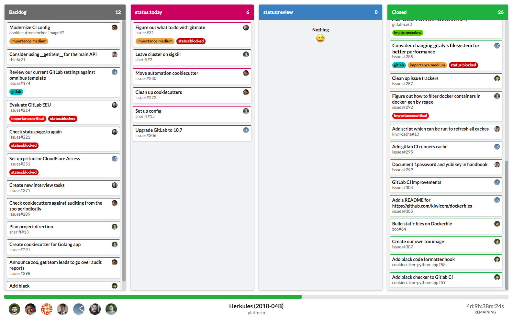

# Dashboarder
## GitLab dashboards for TVs

This project allows displaying GitLab dashboards on our TVs without the need of including user credentials on our Intel Compute Sticks.

Uses GitLab API calls to generate dashboards similar to the ones that [GitLab already provides](https://docs.gitlab.com/ee/user/project/issue_board.html). It uses
the [Issue Boards API](https://docs.gitlab.com/ee/api/boards.html), so it only works with EE editions.

#### Disclaimer
It caches some data so it's not constantly fetched from the API, but it's not fully optimal, as it still fetches *all* the issues every time it loads a board.
Despite it's flaws it's good enough for most of the cases, struggling only when the projects have thousands of issues.

The initial code was written more than one year ago, in just a couple afternoons, there have been multiple changes to the APIs, and there was never a big
interest on displaying the issue boards in our TVs, as there are more important metrics that our teams usually monitor, so only a couple teams at [Kiwi.com](http://kiwi.com)
ended using it.

Just by not fetching all the issues the performance boost will be noticeable. GitLab itself only loads a bunch of issues for every list on the board, and 
loads the rest on scroll, but this project is being re-written to not just cache as much data as possible and make a responsible usage of the APIs, but also to
be reactive, processing GitLab system hooks instead of periodically fetching data.

